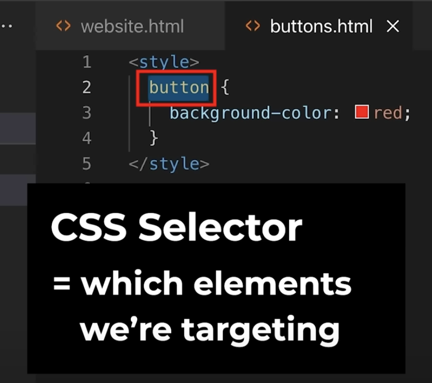
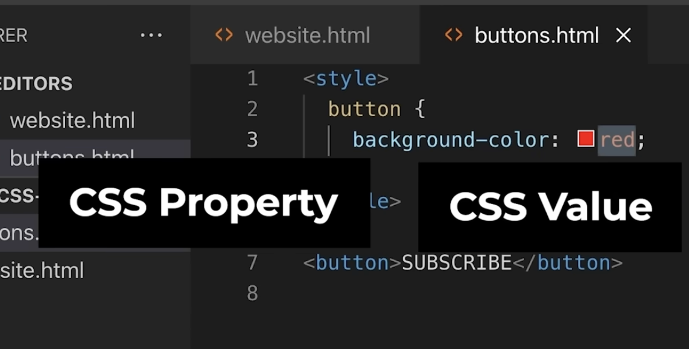

# HTML-CSS

Source : https://youtu.be/G3e-cpL7ofc?si=lRyHt63HMANa_UAq

# Lesson 1 - HTML
* Stands for <b>Hyper text markup language</b>
* HTML = giving instructions to a computer
* HTML Elements - buttons, paragraph tag, etc. - Anything that can be displayed on the webpage. Every element consists of two HTML Tags.
* HTML Tag = <button> is a tag = tells the computer what we're trying to create. 
* HTML Attribute = modifies how an element behaves.

* Extra spaces are ignored in HTML display text. So, for  number of spaces between words > 1 or new lines will still be displayed with a single space -- doesn't matter.

## HTML Elements
### 1. Button
### 2. Paragraph
### 3. Anchor
A link to another website. 
- href (a HTML attribute) defines the link to which the text must be redirected to. 
- target defines whether the link opens in the current page or in a new page. By default, opens in the current page. "_blank" opens in a new tab.

# Exercises
In the "Exercises" Folder.

# Lesson 2 - CSS
* Stands for CSS - Cascading Style Sheets (change the appearance of HTML websites)

## CSS Elements
### 1. CSS Selector
Which elements we are targeting.

### 2. CSS Property
What (part of the element) are we changing?
* Color - property for changing the text color
* Background color - property for changing the background color
* Margin - spacing between the elements.
### 3. CSS Value
What are we changing the property into?

## HTML Attributes for CSS style labelling
### 1. Class
in the HTML element specify as `class = "class_name"`
in CSS to style this HTML element, specify the CSS Selector starting with a '.' like `.class_name {......}`
