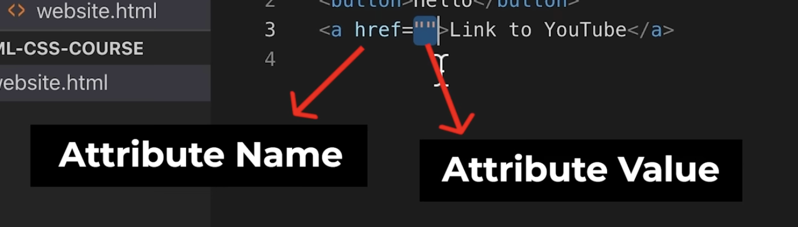

# HTML-CSS

Source : https://youtu.be/G3e-cpL7ofc?si=lRyHt63HMANa_UAq

# HTML
* Stands for <b>Hyper text markup language</b>
* HTML = giving instructions to a computer
* HTML Elements - buttons, paragraph tag, etc. - Anything that can be displayed on the webpage. Every element consists of two HTML Tags.
* HTML Tag = <button> is a tag = tells the computer what we're trying to create. 
* HTML Attribute = modifies how an element behaves.

* Extra spaces are ignored in HTML display text. So, for  number of spaces between words > 1 or new lines will still be displayed with a single space -- doesn't matter.

# HTML Elements
## 1. Button
## 2. Paragraph
## 3. Anchor
A link to another website. 
- href (a HTML attribute) defines the link to which the text must be redirected to. 
- target defines whether the link opens in the current page or in a new page. By default, opens in the current page. "_blank" opens in a new tab.
