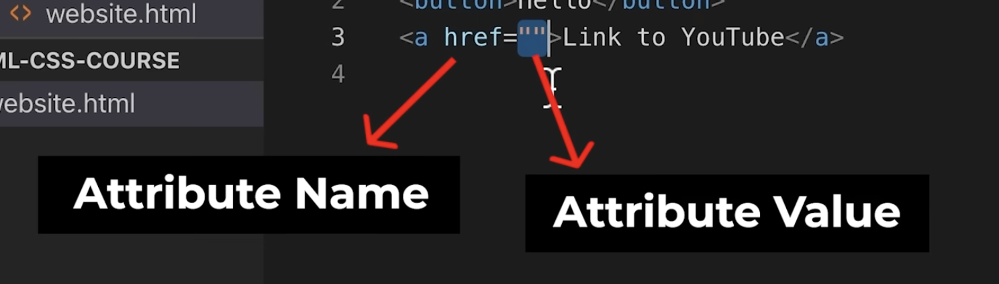
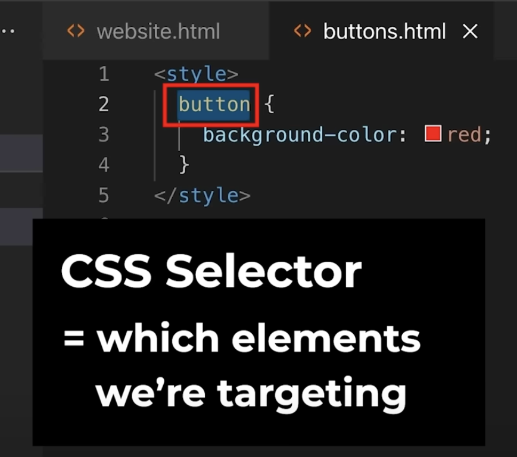
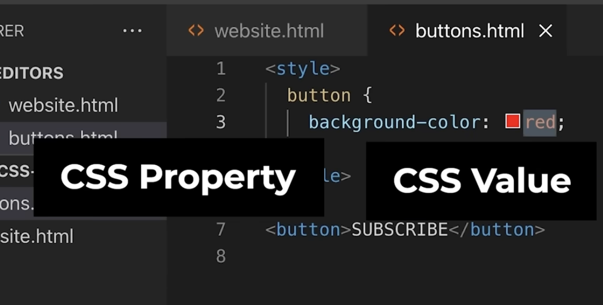
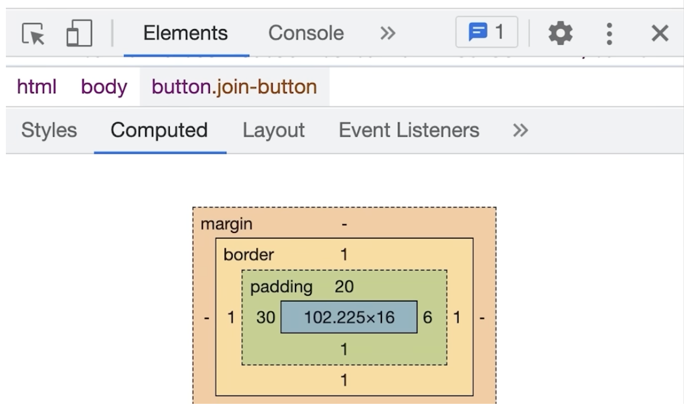

# HTML-CSS

Source : https://youtu.be/G3e-cpL7ofc?si=lRyHt63HMANa_UAq

# Lesson 1 - HTML
* Stands for <b>Hyper text markup language</b>
* HTML = giving instructions to a computer
* HTML Elements - buttons, paragraph tag, etc. - Anything that can be displayed on the webpage. Every element consists of two HTML Tags.
* HTML Tag = <button> is a tag = tells the computer what we're trying to create. 
* HTML Attribute = modifies how an element behaves.

* Extra spaces are ignored in HTML display text. So, for  number of spaces between words > 1 or new lines will still be displayed with a single space -- doesn't matter.

## HTML Elements
### 1. Button
### 2. Paragraph
### 3. Anchor
A link to another website. 
- href (a HTML attribute) defines the link to which the text must be redirected to. 
- target defines whether the link opens in the current page or in a new page. By default, opens in the current page. "_blank" opens in a new tab.

# Exercises
In the "Exercises" Folder.

# Lesson 2 - CSS
* Stands for CSS - Cascading Style Sheets (change the appearance of HTML websites)

## CSS Elements
### 1. CSS Selector
Which elements we are targeting.

### 2. CSS Property
What (part of the element) are we changing?
* Color - property for changing the text color
* Background color - property for changing the background color
* Margin - spacing between the elements.
* Opacity - 0 to 1; 1 represents fully visible element. As the value decreases, the element kinda fades in terms of visibility and 0 makes it invisible.
* Transition - timing for changing from one state to another. Takes 2 values: 
    1. what do you want to transition (the element)
    2. how long should the transition take
* Shadows (box-shadow) - takes 4 values:
    1. Horizontal position of the shadow - shadow appears __px to the right.
    2. Vertical position of the shadow - shadow appears __px down.
    3. Blur - the shadow becomes blurred
    4. Color of the shadow

### 3. CSS Value
What are we changing the property into?

## HTML Attributes for CSS style labelling
### 1. Class
in the HTML element specify as `class = "class_name"`
in CSS to style this HTML element, specify the CSS Selector starting with a '.' like `.class_name {......}`

## Colors
### RGBA 
Same as RGB but A represents the opacity of the color.

## CSS Box model

* How much space an element takes up
* How far it is away from other elements

### 1. Spacing on the outside of the element
Called a <b>Margin</b>. Margin can be added on all 4 sides of the element - top, bottom, right and left.

### 2. Spacing on the inside of the element
To make the element bigger. It's called a <b>Padding</b>.  
Adding the height and width of the elements like we did for the buttons, isn't exactly a good idea. This is because, for example, if we add some extra text, the text overflows outside the button.  
To fix this issue, just remove the height and width property & instead add a padding.  
Just like the case of margin, we have left, right top and bottom Paddings.  

## CSS Alignment 
<b>My take : </b> Browser aligns all the elements according to text by default. If you want to overwrite this behaviour and make the browser align based on elements and NOT the text, you can use the alignment property. 

[https://youtu.be/G3e-cpL7ofc?t=4466](Link)
By default, our browser aligns the buttons according to the text. 'cause browsers in the beginning were text-based. So, to overwrite this behavior and make the browser align the buttons on the same level (top) - we can use `vertical-align : top`

<b>Adjusting paddings & Margins</b>  
Check out the commit - 'Join button slightly bigger than subscribe button' for the buttons_cssboxmodels.html file on macbranch branch - for the problem discussed. 
The extra margin around 'Join' button of 1px makes this button look relatively bigger than the 'Subscribe' button. One of the ways to compensate for this is to reduce the padding of 'Join' button by 1px which will make them look about the same size.